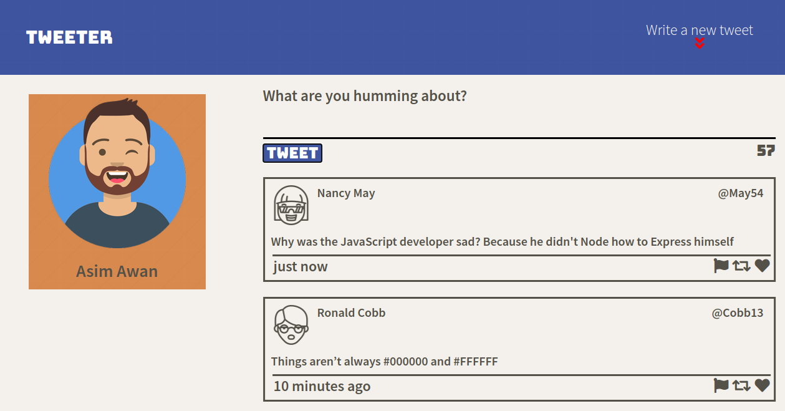
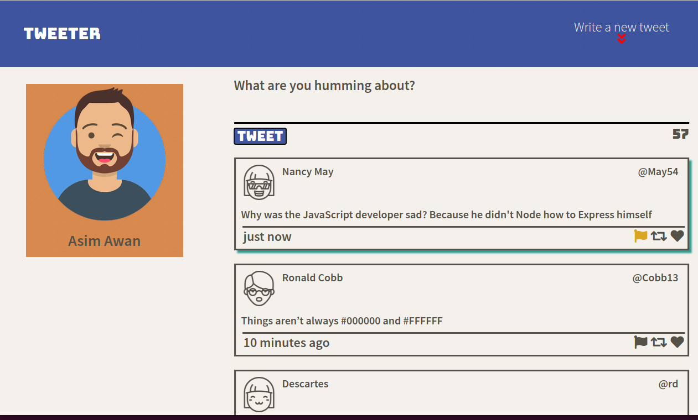
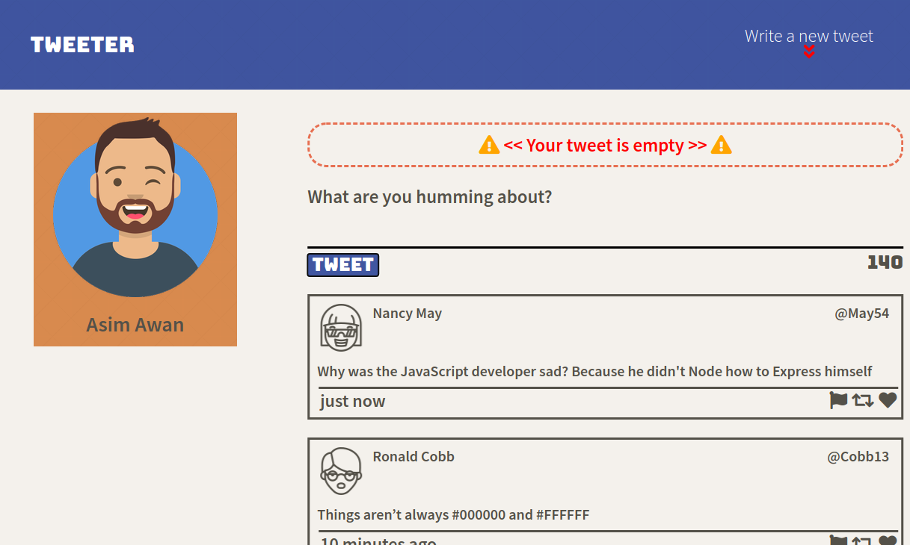
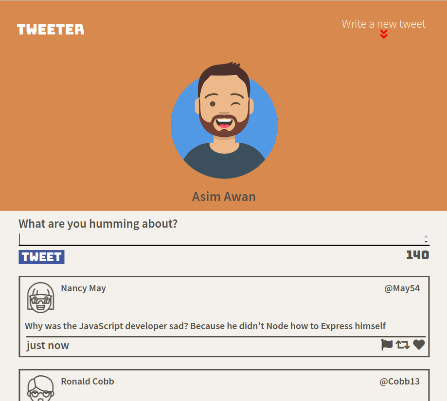

# Tweeter Project

Tweeter is a simple, single-page Twitter clone.

## Project brief

Tweeter is a Single Page App (SPA) built using HTML, CSS, JS, jQuery and AJAX on the client-side and Node, Express on the server-side

## Features

- Tweets get posted without the need to refresh page
- Newest tweet is displayed at the top
- Tweet cannot be more than 140 charachters long
- Appropriate error message is displayed if tweet is empty or too long
- Page design is responsive

## Getting Started

1. Fork this repository, then clone your fork of this repository.
2. Install dependencies using the `npm install` command.
3. Start the web server using the `npm run local` command. The app will be served at <http://localhost:8080/>.
4. Go to <http://localhost:8080/> in your browser.

## Dependencies

- Express
- Node 5.10.x or above
- Body-parser
- Chance
- md5

## Dev Dependencies

- Nodemon

## Screenshots

